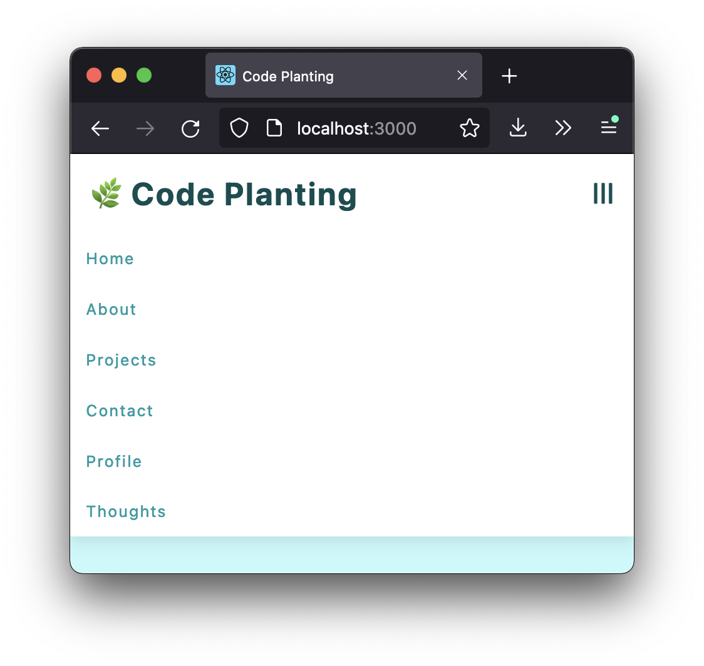

# (DYNAMIC) NAVBAR

**REACT PRACTICE – MINI PROJECTS**

**Learnings**

- React Hooks:
  - `useState` &  `useEffect` (`setTimeout`)
  - `useRef` →  to handle the navbar height on smaller screen for dynamic links

<small>Based on [*John Smilga's "Code 15 React Projects - Complete Course"*](https://youtu.be/a_7Z7C_JCyo) with FreeCodeCamp.org</small>

