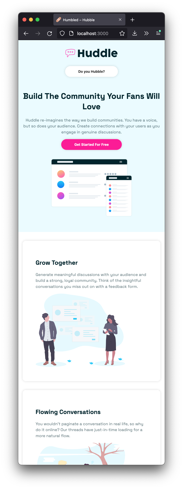

# STYLED COMPONENTS – LANDING PAGE

**REACT PRACTICE – MINI PROJECTS**

**Learnings:**

- Styled Components & dynamic property values

<small>Based on [*Traversy Media – Styled Components Crash Course & Project"*](https://youtu.be/02zO0hZmwnw) </small>

