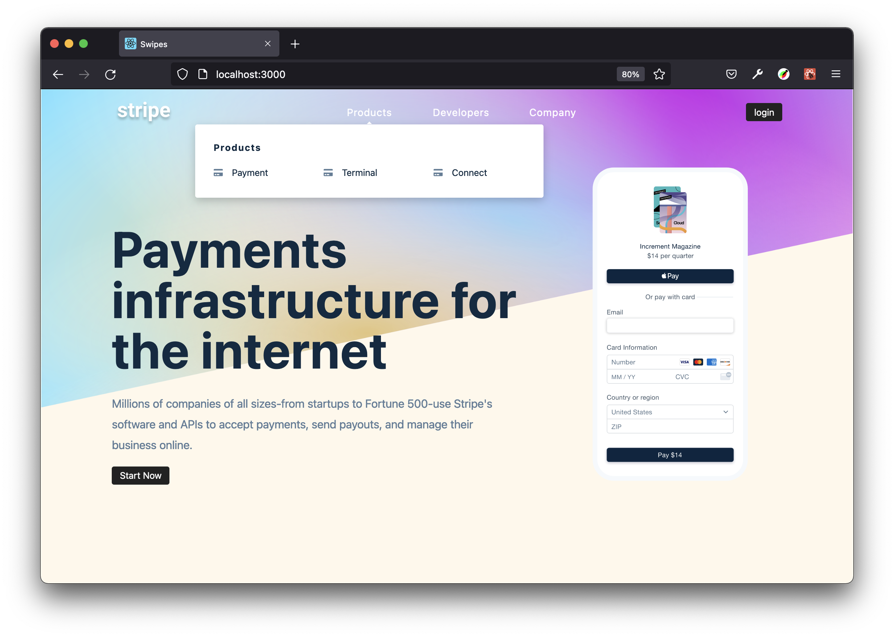
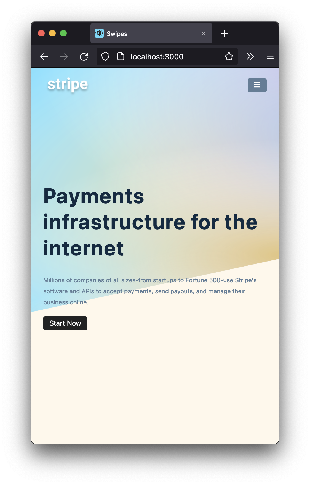
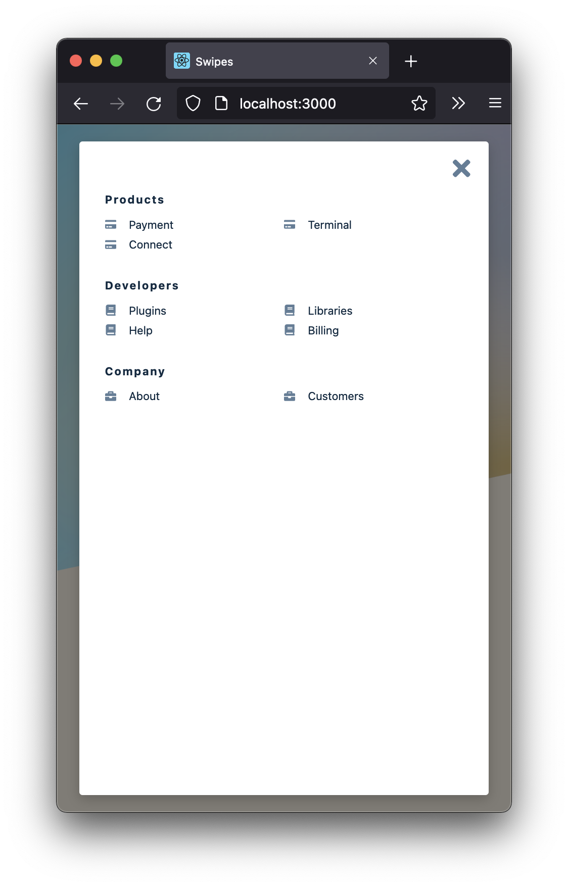

# LANDING PAGE WITH DYNAMIC SUBMENUS

**REACT PRACTICE – MINI PROJECTS**

### Sidebar on mobile view only
The positioning of the submenu `onMouseOver` is calculated through `DOM` elements and each classname is also dynamically customised according to the amount of links in the submenu

**Learnings**

- React Hooks:
  - `useState`
  - `useContext` →  to prevent prop drilling and create cleaner codes
  - custom hooks →  utilising `React.createContext()` and `useContext` together for `useGlobalContext()` custom hook
  - `useRef` – for targetting `DOM` elements references
- Dynamic data – for links and icons instead of harcoding each element

<small>Based on [*John Smilga's "Code 15 React Projects - Complete Course"*](https://youtu.be/a_7Z7C_JCyo) with FreeCodeCamp.org</small>