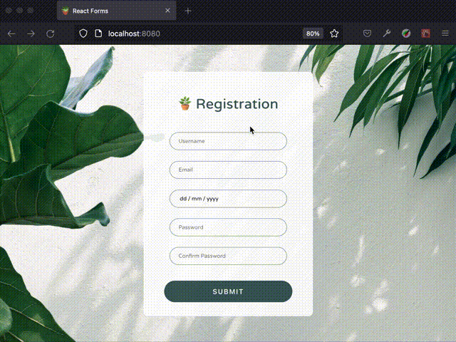

# PURE REACT FORMS

**REACT PRACTICE – MINI PROJECTS**

**Learnings**

Coming from Ruby on Rails, one of the challenging things about React is how to manage forms and validations. This learning is intended to explore how to handle and validate React forms purely–without using any third-party library such as Formik or React-Hook-Forms that I'd like to explore next. 

- Simple validation and UI integration through CSS by utilising HTML's native validation features
- Dynamic data and component handling – implementing DRY and avoiding hard-coding by reusing a component as a template

⚠️ Known issue and to seek for solution:

- Despite matching passwords inputs, the onFocus does not set to false or disappear

Based on [*BEST Ways to Handle and Validate React Forms without a Library*](https://youtu.be/tIdNeoHniEY) with Lama Dev
