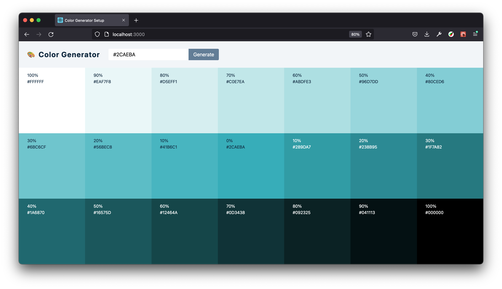

# COLOR GENERATOR

**REACT PRACTICE – MINI PROJECTS**

What to learn and practice:

- React Hooks:
  - useState
  - useEffect →  `setTimeout` with cleanup 
  - utilising `values.js` library for generating colours
  - conditional rendering and formatting
  - dynamic css-js →  conditional formatting
  - DOM →  navigator clipboard (copy value) for `onClick` event

<small>Based on [*John Smilga's "Code 15 React Projects - Complete Course"*](https://youtu.be/a_7Z7C_JCyo) with FreeCodeCamp.org

---

##### References

#### Values JS

[values.js](https://github.com/noeldelgado/values.js)

