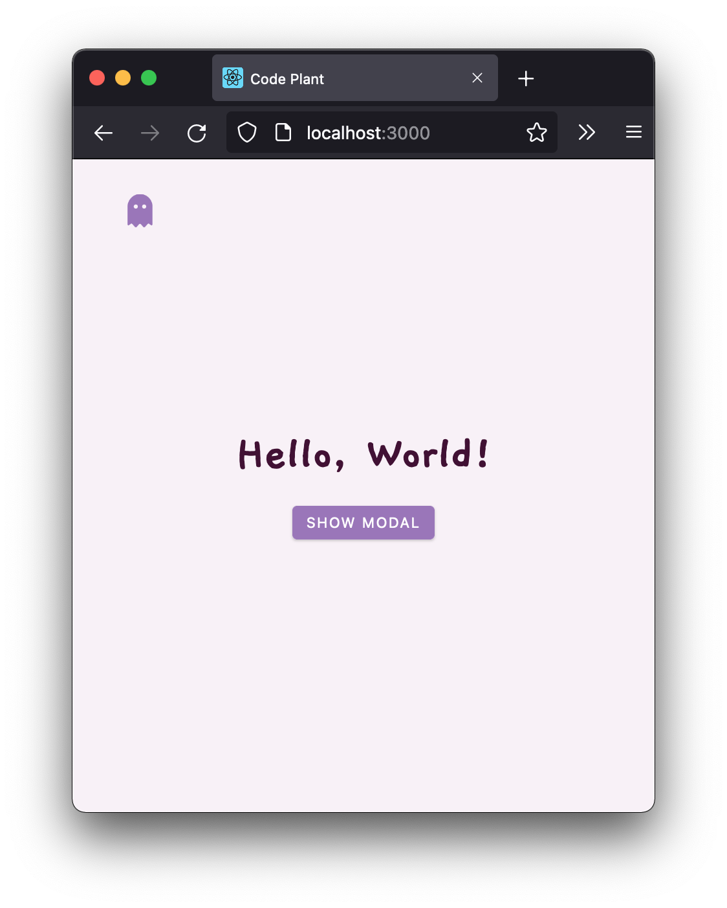
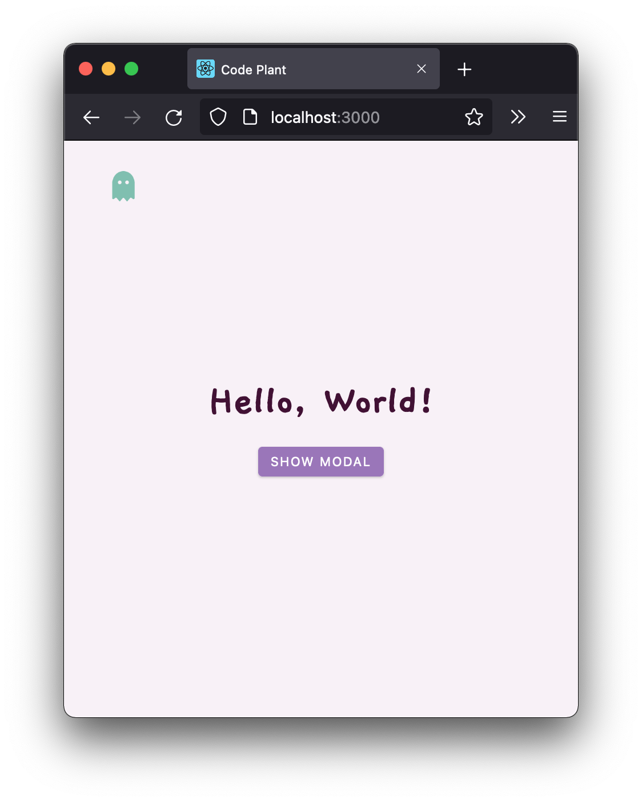
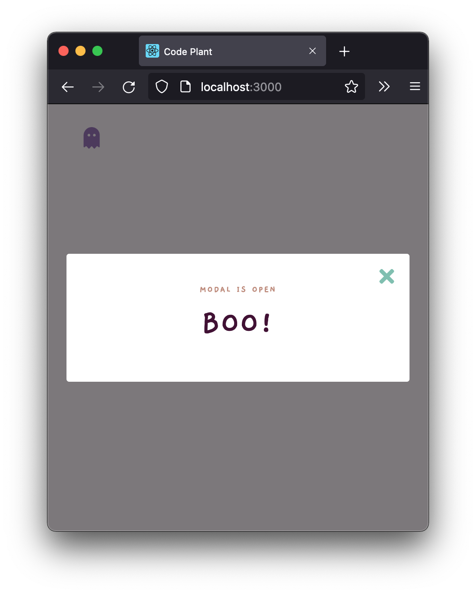

# (DYNAMIC) SIDEBAR & MODAL

**REACT PRACTICE – MINI PROJECTS**

### Sidebar is opened when the `ghost` icon is clicked

### Modal

**Learnings**

- React Hooks:
  - `useState`
  - `useContext` →  to prevent prop drilling and create cleaner codes
  - custom hooks →  utilising `React.createContext()` and `useContext` together for `useGlobalContext()` custom hook
- Dynamic data – for links and icons instead of harcoding each element

<small>Based on [*John Smilga's "Code 15 React Projects - Complete Course"*](https://youtu.be/a_7Z7C_JCyo) with FreeCodeCamp.org</small>

