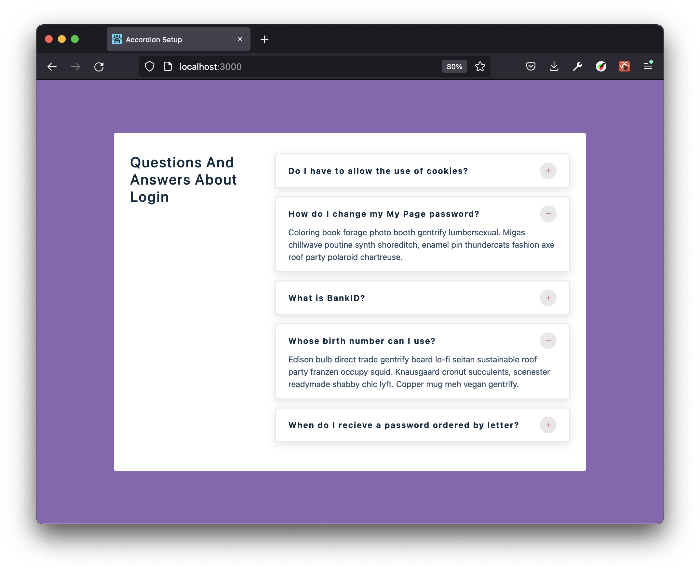

# ACCORDION – QUESTIONS

**REACT PRACTICE – MINI PROJECTS**



What to learn and practice:

- React Hooks:
  - useState
  - useEffect with API fetch
  - Conditional rendering

<small>Based on [*John Smilga's "Code 15 React Projects - Complete Course"*](https://youtu.be/a_7Z7C_JCyo) with FreeCodeCamp.org</small>

---

#### Idea

[uidesigndaily](https://uidesigndaily.com/posts/sketch-accordion-website-day-1175)


#### React Icons

[react icons](https://react-icons.github.io/react-icons/)

```
npm install react-icons --save
```

```javascript
import { FaHome } from 'react-icons/fa';
const Component = () => {
  return <FaHome className='icon'></FaHome>;
};
```
